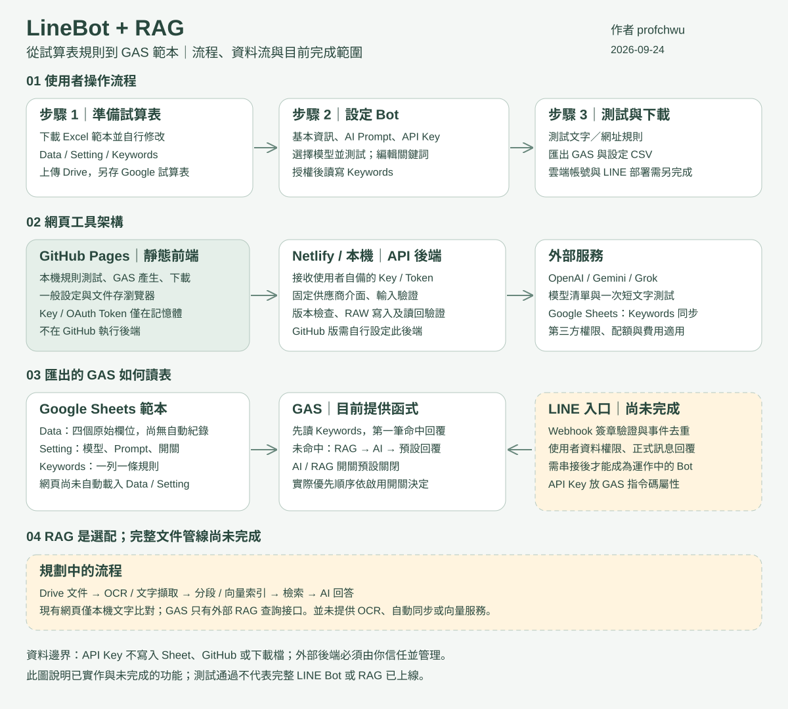

# LineBot + RAG

基本流程：**試算表 → Bot／AI 設定與關鍵詞 → 測試與下載**。AI 與 RAG 預設關閉。

作者：[profchwu](https://github.com/profchwu) · [線上工具](https://profchwu.github.io/linebotrag/)

## 流程與架構



圖中虛線區為尚未完成的功能。網頁目前只同步 Keywords；GAS 可讀取 Data、Setting、Keywords。程式生成採固定範本，並非 AI 自動分析整本試算表後撰寫程式。

## 已實作

- 關鍵詞新增、編輯、停用、移除、排序；完全符合／包含／開頭符合；文字或文字＋網址回覆，第一筆命中優先。
- 本機規則測試，不依賴 AI 或 RAG。
- Google OAuth 授權後讀取、寫入指定試算表「Keywords」工作表。寫入前檢查版本，寫入後讀回驗證。
- OpenAI、Gemini、Grok：輸入自己的 Key、取得模型清單、對選定模型發送真實短文字測試，顯示回覆、延遲及用量。
- CSV 匯入、GAS 產生、Setting CSV／關鍵詞 CSV 匯出。GAS 讀取關鍵詞表，AI／RAG 開關預設 false。
- RAG 選配仍採本機文字檢索；PDF OCR、Drive 背景同步、語意向量索引尚未接通。

## 本機啟動

需要 Node.js 22+，無第三方應用依賴。

```sh
node server/local.mjs
```

Windows 亦可雙擊 `啟動工作台.cmd`，開啟 http://127.0.0.1:4317 。一般靜態伺服器不支援 API 測試或 Google 同步。

## 部署

完整專案包以本資料夾作為儲存庫根目錄；不要上傳外層其他專案。

- Netlify 完整 Git 部署：前端與 Functions 一起部署，支持真實 API。
- GitHub Pages：只發布前端；API 功能需外接自己部署的 Netlify 後端。
- 靜態拖曳包：只有介面與本機功能，沒有 Functions。

詳細步驟見 [DEPLOYMENT.md](DEPLOYMENT.md)。

## 資料與憑證

API Key 與短效 Google Token 只留在頁面及請求記憶體，後端不記錄請求內容；不寫入 localStorage、試算表或程式匯出。重新整理需重新輸入／授權。非秘密的規則、文件與偏好保存在本機；按寫入並確認後才同步 Google。

## 驗證

```sh
node verify.mjs
node verify-deployment.mjs
node --test tests/api.test.mjs
```

外部服務自動測試使用可控制的模擬回應，不消耗真實 Key。需由使用者輸入自己的 Key、Google OAuth Client ID 並授權，才能驗證帳號實際權限、額度及雲端寫入。

LINE Webhook 簽章入口、去重、多租戶帳號、完整 OCR／RAG 背景服務尚未完成。GAS 可產生並測試規則，但未宣稱 LINE Bot 已部署上線。

## Excel 範本

網站第一步提供 `dist/templates/linebot-template.xlsx` 下載。依序為 Data、Setting、Keywords。Data 保留 Time、userid、message、AI_Response 欄名；Setting 的 B 欄可編輯，C 欄說明；Keywords 的 A:G 為可同步規則，I:J 為說明，不參與規則解析。先上傳 Drive 並另存 Google 試算表再連接。AI Key 不放入範本。舊版中文設定與規則分頁仍相容，但新範本統一使用英文分頁名稱。

## 使用免責與作者資訊

作者：**profchwu**，官方專案位置為 [profchwu/linebotrag](https://github.com/profchwu/linebotrag)。本專案與 LINE、Google、OpenAI、xAI 無官方隸屬或背書關係。

本系統按現況提供，供開發與教學試作，不保證輸出正確、不中斷或適合特定用途。請自行檢查產生的程式、AI 回答與文件結果，並完成權限、備份及雲端驗收再正式部署。API、主機及 OCR 等第三方費用由使用者依服務條款負擔。使用者應確認有權處理上傳內容與個人資料。本說明不排除依法不得排除的責任，也不構成安全認證。

Key／Token 會經過使用者設定的後端；只使用自己管理且信任的服務。應用程式不主動持久化憑證，但無法保證外部主機、代理、供應商或瀏覽器擴充套件不保存資料。規則、文件與設定存於瀏覽器，避免在共用裝置使用機密資料。

CSV 匯出會對可能被當成公式的文字加單引號；重新匯入時此前綴可能保留。需要原文可使用已授權的 RAW 寫入。Keywords 同步取代 A:G 內容，請先備份，避免多人同時編輯。

詳細檢查範圍、已修正問題與剩餘限制見 [SECURITY.md](SECURITY.md)。回報漏洞請勿公開附上 Key、Token 或私人資料，可先在儲存庫提出不含敏感細節的問題，再協調通報方式。
